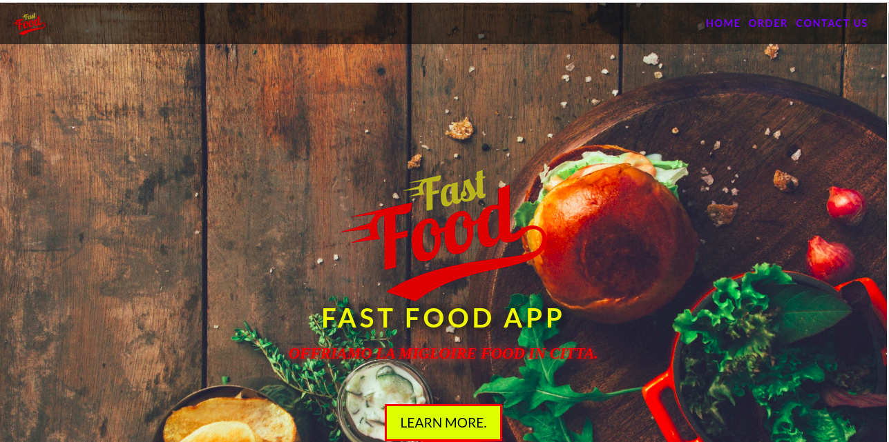

## Kitchen App

#### Description

<table>
<tr>
<td>
This is an app that enables students and staff at TUK to order food from the kitchen app and have it delivered to their classes or offices, or be ready for pick-up.
</td>
</tr>
</table>

#### Authorss

By Boniface Sitati.

### Problem statement

Lunch time is short and with busy schedules makes it even shorter. It becomes a hustle to get food, considering the movement from the person's current location to the food joint, getting the food and eventually back to your workspace.

### Solution

Hence, the project aims to make the process faster, easier and more efficient, and generally time-saving.

### Technologies used

1. HTML
2. CSS
3. Bootstrap
4. Javascript
5. Jquery

### Contact details

For any queries, issues, ideas or concerns, contact any of the authors below:

- [Boniface Sitati]
0706137584

### License

MIT license
Copyright (c) 2023 Team Users
